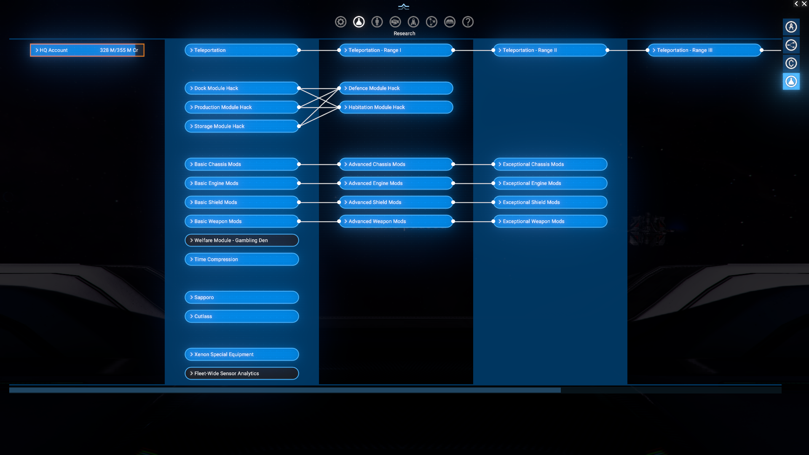
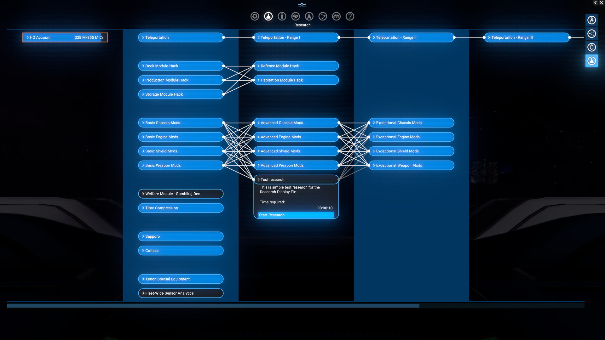
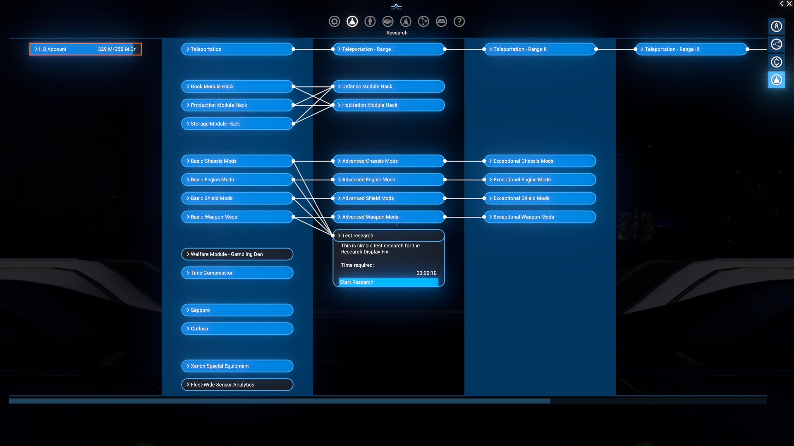

# Fix for Research interdependency visualization

Fixes the research interdependency visualization UI to correctly show dependencies for research items.

## Features

- It is simple fix for the issue usually not seen out of specific mods.
- Compatible with latest version of `kuertee UI Extensions and HUD` mod.

## Limitations

- There is a temporary solution for the issue till Egosoft will fix it in the game itself.
- Mostly be interested for modders that create complex research dependencies.

## Requirements

- `X4: Foundations` 8.00HF3.
- `Mod Support APIs` by [SirNukes](https://next.nexusmods.com/profile/sirnukes?gameId=2659) to be installed and enabled. Version `1.93` and upper is required.
  - It is available via Steam - [SirNukes Mod Support APIs](https://steamcommunity.com/sharedfiles/filedetails/?id=2042901274)
  - Or via the Nexus Mods - [Mod Support APIs](https://www.nexusmods.com/x4foundations/mods/503)

## Compatibility

- If [UI Extensions and HUD](https://www.nexusmods.com/x4foundations/mods/552) by [kuertee](https://next.nexusmods.com/profile/kuertee?gameId=2659) is installed and enabled, this mod will not break its functionality and still provide the fix.

## Installation

You can download the latest version via Steam client - [Research dependency display fix](https://steamcommunity.com/sharedfiles/filedetails/?id=3604448510)
Or you can do it via the Nexus Mods - [Research dependency display fix](https://www.nexusmods.com/x4foundations/mods/1882)

## Usage

- Just install the mod and it will work automatically.

## What is fixed?

The research display UI incorrectly visualizes research dependencies, by showing some not existing ones. This mod corrects that logic to ensure all dependencies are displayed as intended.
Usually it is not seen, except the research has multiple dependencies on a second and next steps and there dependency items has "upper" steps of research dependencies too.

Instead of many words several pictures that shows the difference.

### Vanilla research lines and items

There is how to looks vanilla research screen. Let's focus on the `Ship Mods` research lines.



### Example research item with multiple dependencies

```xml
<ware id="research_test_ware_for_display_fix" name="Test research" description="This is simple test research for the Research dependency display fix" transport="research" volume="1"
  tags="research" sortorder="800">
  <price min="1" average="1" max="1" />
  <research time="10">
    <research>
      <ware ware="research_mod_ship_mk1" />
      <ware ware="research_mod_engine_mk1" />
      <ware ware="research_mod_shield_mk1" />
      <ware ware="research_mod_weapon_mk1"/>
    </research>
  </research>
</ware>
```

i.e. `research_test_ware_for_display_fix` requires four other research items to be completed first. But nothing else is required, and next steps of this research "lines" has no dependencies on new research item and have not cross interdependencies too.

#### Without the fix

There is a mess, instead of simple dependency `Test research` on other four research items ...



#### With the fix




## Bug report about the issue

Please be aware that this issue has been reported to Egosoft already, and you can track its progress here: [[Bug: UI/LUA] Research interdependency visualization issue](https://forum.egosoft.com/viewtopic.php?t=473564)

## Credits

- Author: Chem O`Dun, on [Nexus Mods](https://next.nexusmods.com/profile/ChemODun/mods?gameId=2659) and [Steam Workshop](https://steamcommunity.com/id/chemodun/myworkshopfiles/?appid=392160)
- *"X4: Foundations"* is a trademark of [Egosoft](https://www.egosoft.com).

## Acknowledgements

- [EGOSOFT](https://www.egosoft.com) — for the X series.
- [SirNukes](https://next.nexusmods.com/profile/sirnukes?gameId=2659) — for the Mod Support APIs that power the UI hooks.
- [Forleyor](https://next.nexusmods.com/profile/Forleyor?gameId=2659) — for his constant help with understanding the UI modding!

## Changelog

### [1.00] - 2025-11-12

- Added
  - Initial public version
